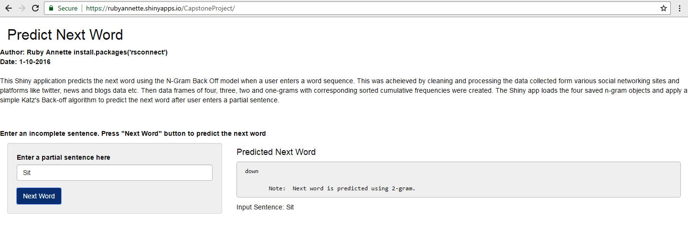

Predicting Next Word App
========================================================
author: Ruby Annette
date: 1.10.2016
autosize: true

Shiny App For Next Word Prediction
========================================================

This is a presentation about a shiny app that would predict the next word. The app could be found here: <https://rubyannette.shinyapps.io/CapstoneProject/>.

The key features of this app are:

- User needs to enter the words in the textbox  and the press the "Next Word" button.
- The predicted next word will be displayed with a note indicating which specific n-gram was used for next word prediction.

- The sentence entered by the User is also displayed in the Shiny GUI.


Introduction
========================================================

```


- This presentation is a high level description of the language modeling Capstone Project of Coursera Data Science Specilization.

- The purpose of this project is to build a natural language model that suggests an appropriate next unseen word in the user specified words sequence. 


- Appropriate data cleaning and sub-setting techniques were applied to finalize the training data. 

- Various word combinations (N-Grams) were then created using clean data sets and a predictive algorithm (Katz Back-off) was applied to predict next word.

- The final predictive model was optimized appropriately to work as a Shiny application.


```

Data Handling and Cleaning
========================================================

```
Prior to building word prediction algorithm, the following steps were executed to handle and clean very large twitter, news and blogs files.

- A subset of the original data was randomly selected from the three sources and merged into one. 


- Due to limitation of computation resources data was divided into various small chunks before cleaning.

- Data cleaning involved converting to lower case, removing punctuations, numbers and non printable characters.

- Four sets of word combinations (n-grams), with 4-words, 3-words, 2-words, and 1-word were then created.

- After calculating their cumulative frequencies, these four n-grams were sorted and saved.

- Low frequency n-grams were further filtered to reduce their size for optimum performance.

- Finally, the four n-gram objects were saved as R-Compressed files (.RData files).

```
Word Prediction Model Used
========================================================

```
The next word prediction model is based on the Katz Back-off algorithm. Here are the steps involved in predicting the next word of the user specified sentence

- Load four compressed data sets containing sorted n-grams with cumulative frequencies. 
- Filter the user specified sequence of words by applying same techniques to clean the training data sets.

- Depending upon the number of words specified by the user, extract last three or two or the last one word.

- First use a 4-gram; the first three words of which are the last three words of the user provided sentence.

- If no 4-gram is matched, back-off to 3-gram. Match first two words of 3-gram with last two words of the sentence.

- If no 3-gram is matched, back-off to 2-gram. Match first word of 2-gram with last word of the sentence.

- Finally if no match found in 2-grams, use the most frequent word from 1-gram as next word.

```
Shiny App For Next Word Prediction
========================================================

The app could be found here: <https://rubyannette.shinyapps.io/CapstoneProject/>.



Shiny App For Next Word Prediction
========================================================
How to use this app?

- Enter the words in the textbox  and the press the "Next Word" button.

- The predicted next word will be displayed in the  "Predicted Next Word" text box.

- The textbox will also display the details about the specific n-gram used for predicting the next word.

- The words that you entered will also displayed in the Shiny GUI below the textbox.
